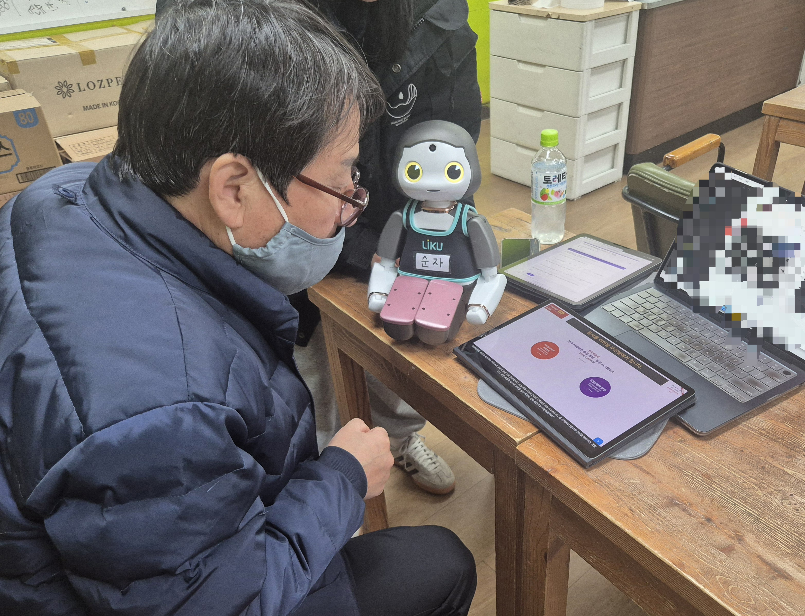

어르신 키오스크 교육 플랫폼
=
[한동대학교 전산전자공학부 **신예준, 김하람, 이의진**] with **`torooc`**

### 문제배경
- COVID-19 이후 비대면 서비스의 확산으로 인해 키오스크 사용 비율이 급격히 증가하였다. 그러나 키오스크 사용에 익숙하지 않은 고령층은 이를 사용하는 데 많은 어려움을 겪고 있으며, 이는 일상생활의 불편함으로 이어진다.

- 이러한 이유로 어르신들을 대상으로 한 키오스크 교육 및 관련 서비스가 증가하고 있으며, 그 필요성이 더욱 강조되고 있다. 
- 그러나 현재 제공되고 있는 관련 교육 프로그램과 서비스는 접근성이 제한적이며, 학습자의 자율성을 충분히 보장하지 못하는 문제가 있다.

### 프로그램 주요 기능
1. **키오스크 시뮬레이션 앱**: 동서울터미널 버스표 예매 키오스크의 사용자 인터페이스를 Flutter를 활용해 재현한 앱으로, 사용자가 키오스크 사용 과정을 학습할 수 있도록 설계되었습니다.


2. **AI 피드백 제공**: ChatGPT 및 LangChain을 활용하여 사용자의 입력을 분석하고, 실시간으로 맞춤형 피드백을 제공합니다.

3. **자율 학습 지원**: 학습자가 매번 무작위로 생성된 학습 목표를 수행하며, 자율적으로 학습할 수 있는 환경을 제공합니다.

4. **로봇과의 연동**: Azure 서버와 MQTT를 통해 소셜 로봇(Liku)과 연동하여, 음성을 통한 실시간 상호작용과 격려 피드백을 제공합니다.


5. **교육 효과 강화**: 노년층을 포함한 디지털 소외 계층의 키오스크 사용 능력을 향상시키기 위해 설계되었으며, 사용자가 실수하더라도 학습을 이어갈 수 있도록 심리적 안정감과 자율성을 제공합니다.


시연영상 : https://youtu.be/iVV--e8ptLw

### 폴더 구조
`lib` : 키오스크 앱을 구성하는 폴더로 dart 파일이 들어있습니다.
`lib/utils/network_utils.dart`: 키오스크와 서버간 데이터 이동을 http로 돕습니다. 서버 주소에 유의해 주세요.
1. Chrome과 같은 Local 개발시 [**http://127.0.0.1:8000**] 사용 
2. 테블릿 연결시 Window의 cmd -> ipconfig 명령어 사용후, [**IPv4 주소:8000**] 사용
3. 서버 연결시 [**서버주소:8000 사용**]

`Back-end`: 키오스크 앱과 서버간의 통신과 AI 응답 생성을 담당합니다.
### 사용 방법
1. Back-end에서 FastAPI 실행
```bash
cd Back-end
uvicorn main:app --reload --host 0.0.0.0 --port 8000
```

2. lib/main.dart에서 앱 실행

3. 키오스크 앱에서 버튼 눌러서, 서버에 표시되는지 확인 & 리쿠 발화 확인

### 연구 실적
교내 캡스톤 경진대회 우수상 수상

교외 한국정보기술학회 논문 은상 수상
